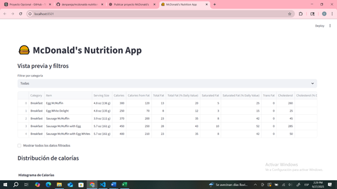
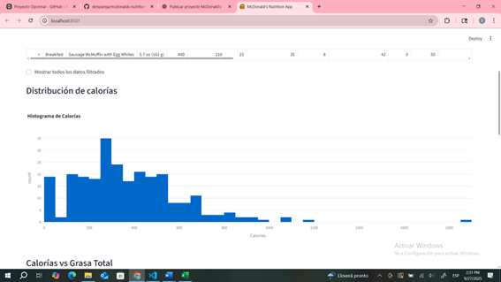
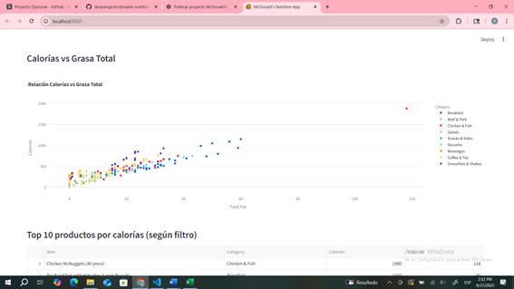

# 🍔 McDonald's Nutrition App

Mini app en **Streamlit** para explorar el contenido nutricional del menú de McDonald's.  
Incluye vista previa, filtros por categoría, gráficos interactivos y un Top 10 por calorías.

## Demo
(Agrega aquí el link si publicas en **Streamlit Cloud** o **Render**)

## Funcionalidades
- Vista previa del dataset.
- **Selectbox** para filtrar por **Category** (o ver **Todas**).
- **Checkbox** para mostrar todos los datos filtrados.
- Histograma de **Calories**.
- Dispersión **Calories vs Total Fat** (coloreado por categoría, con *hover* en `Item`).
- **Top 10** productos por calorías (según el filtro).
- **Estadísticas descriptivas** rápidas.

## Screenshots




## Estructura del proyecto
mcdonalds-nutrition-app/
├─ app.py
├─ mcdonalds.csv
├─ requirements.txt
├─ README.md
└─ img/
├─ preview.png
├─ hist.png
└─ scatter.png

## Requisitos
- Python 3.11+ (probado en 3.12)
- `streamlit`, `pandas`, `plotly`

## Instalación y ejecución local

**Con pip (entorno virtual recomendado):**
```bash
pip install -r requirements.txt
streamlit run app.py
Con Conda (como usé en desarrollo):

bash
Copy code
conda create -n mcdonalds python=3.12 -y
conda activate mcdonalds
python -m pip install -r requirements.txt
python -m streamlit run app.py
La app se abre en: http://localhost:8501

Uso rápido
Abre la app.

Elige una categoría en el selectbox (o “Todas”).

(Opcional) Marca “Mostrar todos los datos filtrados”.

Explora los gráficos, el Top 10 y las estadísticas.

Hallazgos breves
Relación Calorías–Grasa Total: existe una tendencia positiva; a mayor Total Fat, mayores Calories (se aprecia en el gráfico de dispersión).

Productos más calóricos: los ítems de desayuno y sándwiches concentran los valores superiores de calorías; en contraste, ensaladas y bebidas sin azúcar tienden a estar en el rango bajo–medio.

Distribución sesgada a la derecha: el histograma muestra muchos productos en rangos bajos/medios de calorías y pocos muy altos (cola derecha).

Exploración por categoría: con el selectbox se comparan rápidamente alternativas “ligeras” dentro de cada grupo.

Dataset
Fuente: Kaggle — McDonald's Nutrition Facts (CSV).
Asegúrate de guardar el archivo como mcdonalds.csv en la raíz del proyecto.

Tecnologías
Python, Streamlit, Pandas, Plotly

Notas
La carga del CSV está cacheada con st.cache_data (si lo habilitas) para mejorar rendimiento.

Si publicas en Render, usa:

Build: pip install -r requirements.txt

Start: streamlit run app.py --server.port $PORT --server.address 0.0.0.0

Licencia
MIT (opcional)


